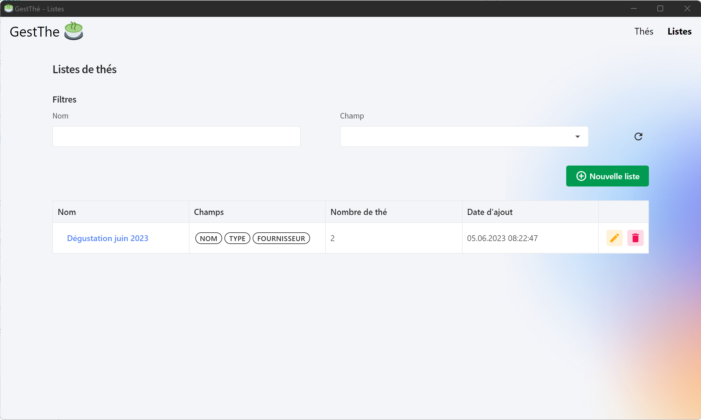

  

# GestThé (Français)

Ce projet intervient dans le cadre de mon **TPI** (Travail Pratique Individuel) permettant de valider mon **CFC**.

Le but est de réaliser une **application de bureau** (Windows 10/11 64bits) permettant la gestion d’une collection de thés.

Il doit être possible d’effectuer les opérations **CRUD** sur les différents éléments constituant la collection.
Des listes permettent de l’organiser en groupant les thés (par année ou provenances par exemple).

Ces listes doivent être exportables en **PDF** et **CSV**.

L’application est développée à l’aide de **Blazor Server** et est encapsulée dans une application de bureau à l’aide d’**Electron.NET**. Les différentes données relatives à la collection sont stockées dans une base de données **SQLite**.

## Technologies utilisées

- **Blazor Server**
- **Entity Framework**
- **SQLite**
- **ElectronNET**
- **Blazor Radzen**

## Compatibilité
- Windows 10/11 (64 bits)

## Fonctionnalités Principales

- Ajout de thés à la collection
- Création de liste de thés avec des champs personnalisés
- Impression PDF
- Exportation CSV

## Installation
1. Télecharger la dernière version [ici](https://github.com/SebastienDuruz/TPI-GestionCollectionDeThe/releases/)
2. Exécuter le fichier **GestThe_X.X.X.exe**
3. Windows détecte que la source n'est pas connue, cliquer sur **Plus d'infos** -> **Exécuter quand même**
4. Cocher la case **Seulement pour moi** et cliquer sur **Installer**
5. L'application est maintenant installée, il ne reste plus qu'a fermer l'installeur

## Utilisation

L'application se nomme *GestThé*, une fois ouverte la page ci-dessous est ouverte :

Cette page contient les différentes fonctionnalités liés aux **thés** :

- Ajout
- Modification
- Copie
- Suppression
- Impression PDF
- Exportation CSV

Une page détaillant les informations d'un thé est accessible en cliquant sur le **nom d'un thé** :

Lorsque l'on clique sur *Listes* en haut à gauche de la fenêtre, la page relative aux listes de thés est ouverte :

Cette page contient les différentes fonctionnalités liés aux **listes de thés** :

- Ajout
- Modification
- Suppression

Une page détaillant les informations d'une liste de thé est accessible en cliquant sur le **nom de la liste** :

Cette page permet d'accèder aux fonctionnalités suivantes :

- Impression PDF de la liste
- Exportation CSV de la liste

### Administration des données

#### Paramètres de l'application

Un fichier *settings.json* contenant les **paramètres** de l'application est disponible à l'adresse suivante :

> C:\Users\USERNAME\AppData\Local\GestThe\settings.json

Ce fichier contient la **position** et la **taille** de la fenêtre afin de la replacer au prochain démarrage de l'application.

#### Fichier DB (SQLite)

Le fichier DB contenant les informations de la collection est accessible à l'adresse suivante :

> C:\Users\USERNAME\AppData\Local\Programs\gest-the\resources\bin\gestTea.db

Ce fichier peut être édité par un **utilisateur technique** afin d'ajouter, modifier ou supprimer les **données disponible concernants les thés** :

- Les types
- Les variétés
- Les provenances
- Les fournisseurs

## Licence
**GestThé** est un logiciel libre sous [GNU Affero General Public License V3](LICENSE)

# GestThé (English)

This project is part of my **TPI** (Travail Pratique Individuel) to validate my **CFC**.

The aim is to create a **desktop application** (Windows 10/11 64bits) to manage a tea collection.

It must be possible to perform **CRUD** operations on the various elements making up the collection.
Lists can be used to organize the collection by grouping teas (by year or provenance for example).

These lists must be exportable in **PDF** and **CSV**.

The application is developed using **Blazor Server** and encapsulated in a desktop application using **Electron.NET**. The various data relating to the collection are stored in a **SQLite** database.

## Technologies used

- **Blazor Server**
- **Entity Framework**
- **SQLite**
- **ElectronNET**
- **Blazor Radzen**

## Compatibility
- Windows 10/11 (64 bits)

## Main features

- Add teas to the collection
- Create tea lists with custom fields
- PDF printing
- CSV export

## Installation
1. Download the latest version [here](https://github.com/SebastienDuruz/TPI-GestionCollectionDeThe/releases/)
2. Run file **GestThe_X.X.X.exe**.
3. Windows detects that the source is unknown, click on **More info** -> **Run anyway**.
4. Check the box **Only for me** and click on **Install**.
5. The application is now installed, all that remains is to close the installer.

## Use

The application is called *GestThé*, once opened the page below is opened:

This page contains the various functionalities related to **themes**:

- Add
- Modify
- Copy
- Delete
- PDF printing
- CSV export

A page detailing information about a tea can be accessed by clicking on the **tea name** :

Clicking on *Lists* at the top left of the window opens the tea lists page:

This page contains the various functions related to **tea lists**:

- Add
- Modify
- Delete

A page detailing information about a tea list can be accessed by clicking on the **list name** :

This page provides access to the following functions :

- PDF printout of list
- CSV export of list

### Data administration

#### Application settings

A *settings.json* file containing the application's **parameters** is available at the following address:

> C:\Users\USERNAME\AppData\Local\GestThe\settings.json

This file contains the **position** and **size** of the window, so that it can be replaced the next time the application is started.

#### DB file (SQLite)

The DB file containing the collection information can be accessed at the following address:

> C:\Users\USERNAME\AppData\Local\Programs\gest-theresources\bin\gestTea.db

This file can be edited by a **technical user** in order to add, modify or delete available **tea data** :

- Types
- Varieties
- Provenances
- Suppliers

## License
**GestThé** is free software under [GNU Affero General Public License V3](LICENSE)
